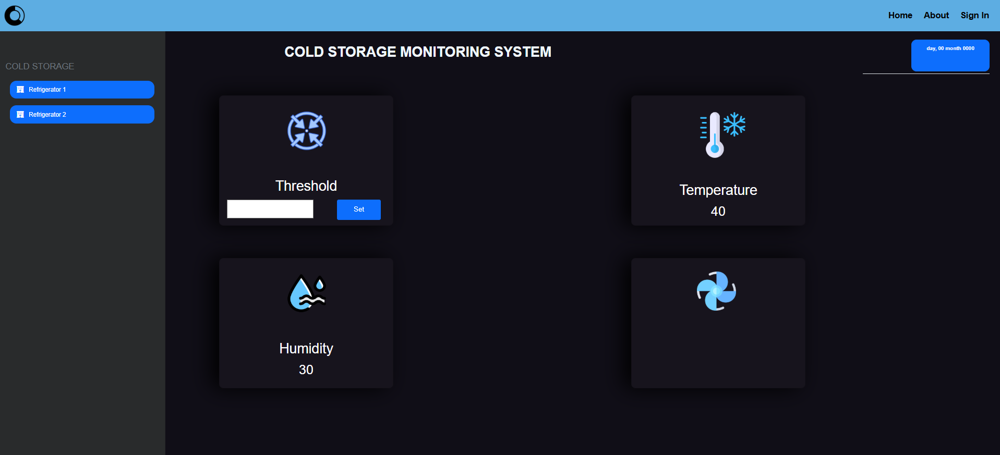

# Cold Storage Automation

**Automating Cold Storage Facility For Temperature Monitoring and Control**  

In the field of cold storage facilities, preserving products at the desired temperature is crucial. Manual temperature monitoring is labor-intensive and error-prone, potentially compromising the quality of stored goods.  

This project introduces an **automated cold storage monitoring system** using advanced technologies like the DHT sensor, ESP8266 WiFi module, relay, DC motor, and fan. It enables reliable temperature control, real-time monitoring, alerts, and remote access, improving efficiency and product safety.

---

## Features

- **Temperature Monitoring:** Continuously monitor temperature with a DHT sensor.  
- **Threshold Setting:** Set a temperature threshold.  
- **Wireless Connectivity:** Remote monitoring via ESP8266 WiFi module.  
- **Data Logging:** Record temperature data for analysis.  
- **Automated Cooling:** Activate fan via relay when temperature exceeds threshold.  
- **User Interface:** Web interface for control and monitoring.  
- **Data Analysis:** Analyze temperature trends over time.

---

## Objectives

- Ensure reliable and automatic temperature control.  
- Minimize manual labor and human error.  
- Provide remote monitoring and alerts.  
- Maintain quality and safety of stored products.

---

## Hardware Requirements

- DC Motor  
- Arduino  
- Jumper Wires  
- DHT22 Temperature Sensor  
- Relay Module  
- ESP8266 WiFi Module  
- 5V Power Supply  
- 3.7V Battery  
- Breadboard  
- Fan  

---

## Software Requirements

- HTML  
- CSS  
- JavaScript  
- VSCode  
- Arduino IDE  

---

## Architecture Diagram

*Prototype hardware setup showing ESP8266, DHT sensor, relay, and fan connections.*

---

## Analysis of Temperature & Humidity for Cold Storage Monitoring

  

---

**Thank You**
